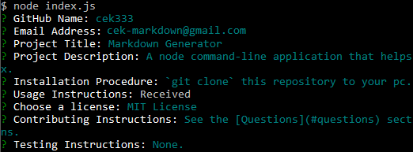

# Markdown Generator

## Description
A node command-line application that helps users generate good readme files in the Markdown syntax.

## Installation
`git clone` this repository to your pc. Use node to run the application: `node index.js`.

## Usage
You'll be prompted to answer a series of questions; the answers to which will be used to populate the generated readme file. 

Note, at the prompt for entering your project's Usage instuctions, your system's default editor will open up. Configure the $VISUAL or $EDITOR environment variables to set your default editor. If neither of these are set, notepad (on Windows) or vim (Linux or Mac) will be used. When you save and close the editor, your responses will be captured by the application.

The generated README includes the following sections: 
  * Title
  * Description
  * Table of Contents
  * Installation
  * Usage
  * License
  * Contributing
  * Tests
  * Questions

The generated markdown file will be named `<Project-Title>-README.md`. Any spaces in the project title will be replaced with dashes.

A video showing the application in action can be viewed [here](https://drive.google.com/file/d/1lx1F0ZkwMWwphJmd7-iqiSQd-Xi918Bz/view?usp=sharing).

## License

